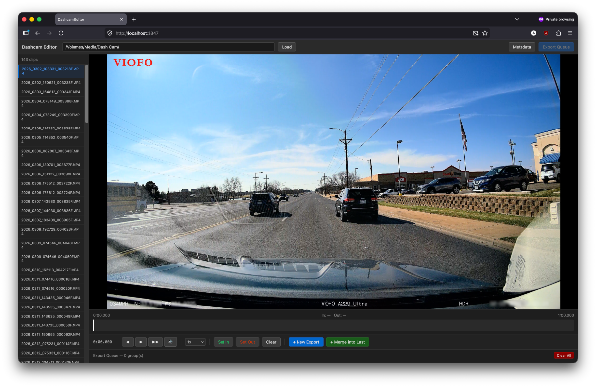

# Dashcam Editor

A local web app for triaging and exporting clips from a Viofo dashcam on macOS. No cloud upload, no installation beyond Node.js — ffmpeg is bundled automatically.



## Requirements

- Node.js 18+
- macOS (arm64 or x64)

## Setup

```bash
cd dashcam-editor
npm install
npm start
```

Then open **http://localhost:3847** in your browser.

## Usage

### 1. Load your clips

Paste the path to your clips folder into the toolbar and click **Load**. The sidebar will populate with all video files found in that folder.

> For a Viofo dashcam, this is typically the SD card path like `/Volumes/VIOFO/Movie` or a local folder you've copied clips into.

### 2. Review a clip

Click any clip in the sidebar to open it in the player. Use the timeline or keyboard shortcuts to scrub through the footage.

### 3. Set in/out points

Mark the portion of the clip you want to keep:

- Press **I** (or click **Set In**) to set the start of the selection
- Press **O** (or click **Set Out**) to set the end
- Drag the green (in) or red (out) markers on the timeline to adjust
- Press **C** or click **Clear** to remove markers (exports the full clip)

### 4. Build the export queue

Each entry in the queue becomes one output file.

- **+ New Export** (`Q`) — adds the current clip as a new, independent export
- **+ Merge into Last** (`Shift+Q`) — appends the current clip to the previous queue entry so they are concatenated into a single file

**Consecutive clip detection:** Viofo saves footage as 1-minute segments. When you navigate to a clip whose timestamp immediately follows the last queued clip, a green banner appears offering to merge them automatically.

### 5. Export

Click **Export Queue** in the toolbar. A dialog will appear where you can:

- Set the output folder
- Rename each export file (defaults to the source clip's filename)

Click **Export All** to process. Each group is exported independently using stream copy (fast, no re-encoding).

## Keyboard Shortcuts

| Key | Action |
|-----|--------|
| `Space` | Play / Pause |
| `I` | Set In point |
| `O` | Set Out point |
| `Q` | Add to queue as new export |
| `Shift+Q` | Merge into last queue group |
| `M` | Mute / Unmute |
| `,` | Step back one frame |
| `.` | Step forward one frame |
| `←` / `→` | Seek ±5 seconds |
| `Shift+←` / `Shift+→` | Seek ±10 seconds |

## Metadata Panel

Click **Metadata** in the toolbar to open a panel showing technical info for the selected clip: resolution, frame rate, codec, bitrate, file size, creation timestamp, and GPS tag (if present in the file).

## Notes

- Exports use `-c copy` (stream copy), so processing is fast and there is no quality loss
- Multi-clip exports trim each segment first, then concatenate — intermediate temp files are cleaned up automatically
- The app only reads from and writes to paths you specify; no files are modified in place
